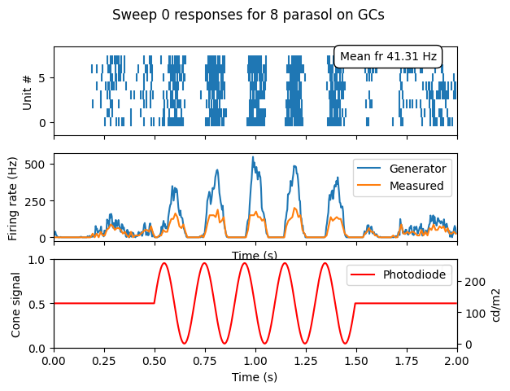

## Build, run and view single simulation
These examples are from docs/examples, where you can run them as script.  
All parameters are from macaqueretina/parameters/ yaml files, unless changed in the examples. 


This example shows how to build, stimulate and simulate a small retina patch and see the resulting output.
Note that the `plt.show()` is necessary to render the figure after all viz commands.


```python
import matplotlib.pyplot as plt
import macaqueretina as mr
```

### Build retina, make stimulus and simulate
```python
mr.construct_retina()
mr.make_stimulus()
mr.simulate_retina()

```

### Show multiple units for single trial
for all temporal models

```python
mr.viz.show_all_gc_responses(savefigname=None)
plt.show()
```
Try optional argument `savefigname="Visualize_fig1.png"`. This image will be saved into your model_root_path/project/experiment -directory. For available image formats, see [matplotlib.pyplot.savefig](https://matplotlib.org/stable/api/_as_gen/matplotlib.pyplot.savefig.html)


You should get 

- Top: rasterplot with action potentials
- Middle: generator potential after nonlinearity (blue) and measured firing rate (orange). 
- Bottom: stimulus middle pixel voltage value, normalized to cone signal and luminance.


Next, without quitting the python session (keep the imported mr object), additional viz methods include


```python
mr.viz.show_all_generator_potentials(savefigname=None)

mr.viz.show_stimulus_with_gcs(
    example_gc=None,  # [int,], None for all
    frame_number=180,  # depends on fps and baseline lengths
    show_rf_id=False,
    savefigname=None,
)

mr.viz.show_single_gc_view(unit_index=2, frame_number=31, savefigname=None)

mr.viz.show_gc_noise_hist_cov_mtx(savefigname=None)
```

for fixed temporal model only
```python
mr.viz.show_spatiotemporal_filter_sums(savefigname=None)

mr.viz.show_spatiotemporal_filter(unit_index=1, savefigname=None)

```

for subunit temporal model only 
```python
mr.viz.show_cone_responses(time_range=[0.0, 1.1], savefigname=None)
```

### Interactive plot of spike frequency on stimulus video 
```python
video_file_name = mr.config.visual_stimulus_parameters.stimulus_video_name
response_file_name = mr.config.run_parameters.gc_response_filenames[0] + ".gz"

window_length = 0.1  # seconds
rate_scale = 20  # Hz, Colorscale max amplitude
mr.viz_spikes_with_stimulus(
    video_file_name, response_file_name, window_length, rate_scale
)

```